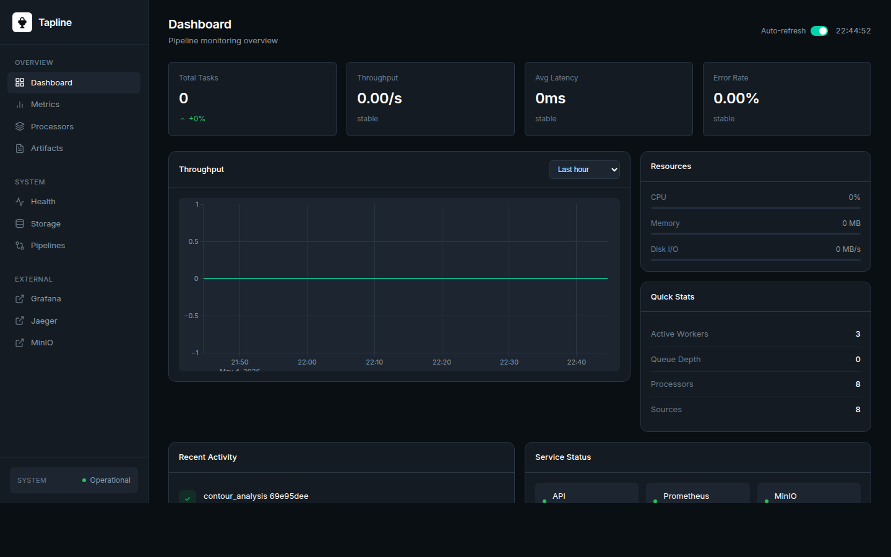
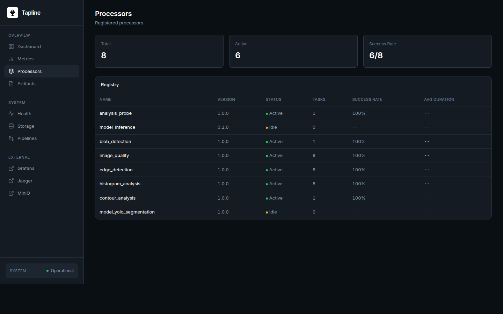
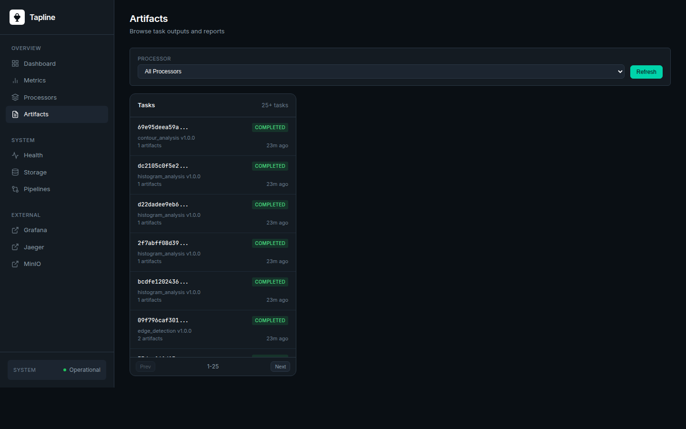
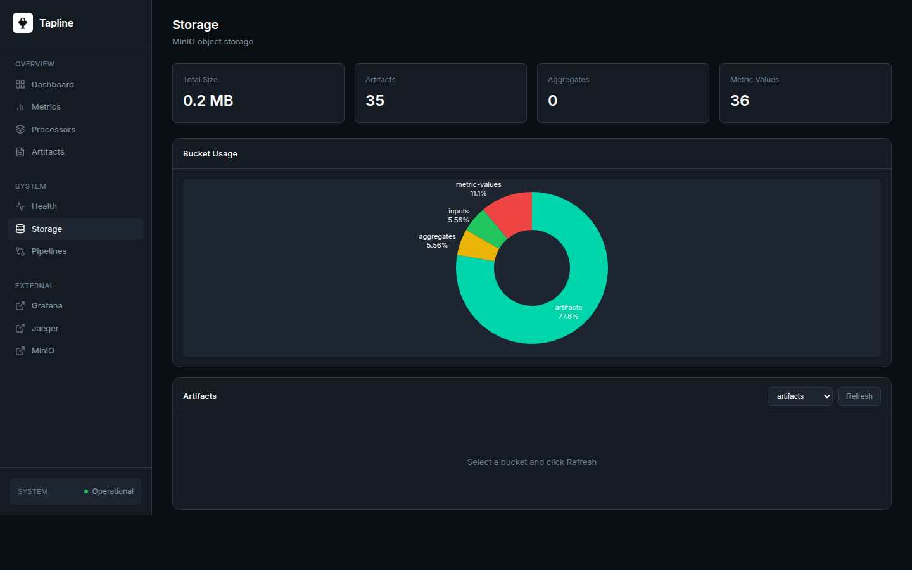
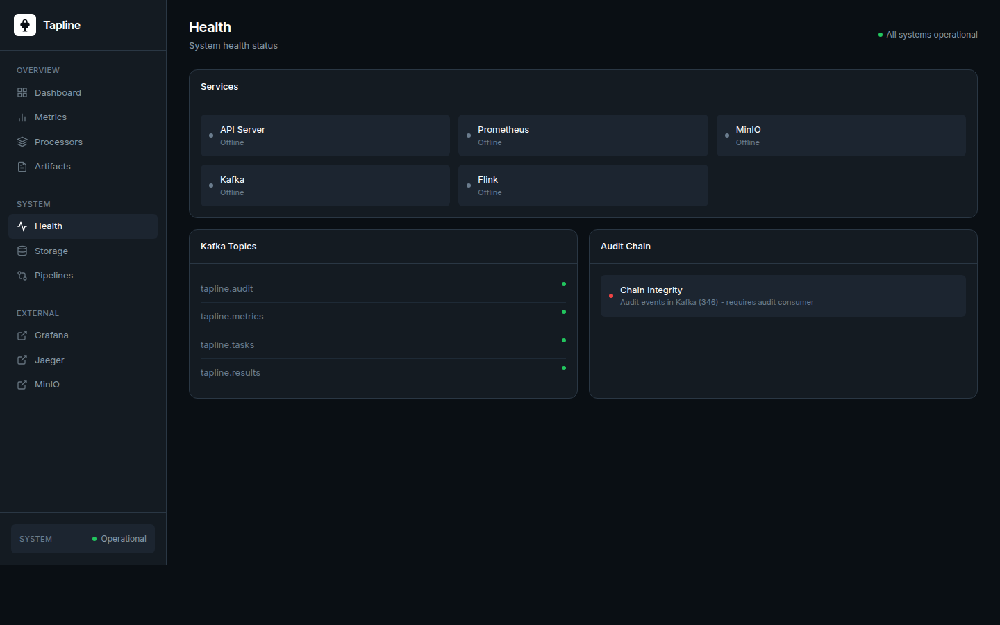

<div align="center">

# Tapline

**Configuration-driven evaluation pipeline for continuous data ingestion, processing, and time-windowed analysis.**

[](https://github.com/parisj/Tapline/actions/workflows/tests.yml)
[](https://codecov.io/gh/parisj/Tapline)
[](https://www.python.org/downloads/)
[](LICENSE)

<sub>Ingest -> Kafka -> Workers -> Processors -> MinIO -> Aggregation -> Dashboard</sub>

<br>



</div>

---

> Tapline was developed in a private repository and made public after the initial framework reached stability. Full history: [PR #1](https://github.com/parisj/Tapline/pull/1).

## What is Tapline

Tapline is an opinionated framework for building **streaming evaluation pipelines** that
behave the same in development and production:

- **File ingest** is a directory observer with content-hash deduplication and stability detection
- **Routing** is one TOML table per directory, mapping files to a `(processor, version, settings)` tuple
- **Execution** is a Kafka-backed worker pool with cooperative-sticky partition assignment, batched offset commits, and parallel artifact uploads
- **Storage** is content-addressed MinIO with sharded keys (`bucket/ab/cd/<hash>`)
- **Aggregation** turns measurements into time-windowed summaries via a Python pipeline (Flink SQL is optional)
- **Audit** is an SHA-256 hash chain over every event for tamper-evident replay
- **Dashboard** is a single Flask app that surfaces tasks, artifacts, processor health, storage breakdown, and Prometheus metrics

The framework makes no assumption about what your processors do. The included
examples (`analysis_probe`, `blob_detection`, `edge_detection`, `image_quality`,
`histogram_analysis`, `contour_analysis`) are illustrative; the pipeline itself
is domain-agnostic.

## Dashboard

A built-in Flask dashboard renders pipeline state in real time, with deep links per tab.

<table>
<tr>
<td width="50%"></td>
<td width="50%"></td>
</tr>
<tr>
<td align="center"><sub>Processors registry &mdash; live task counts and status</sub></td>
<td align="center"><sub>Artifact browser &mdash; per-task outputs from MinIO</sub></td>
</tr>
<tr>
<td width="50%"></td>
<td width="50%"></td>
</tr>
<tr>
<td align="center"><sub>Storage &mdash; bucket usage breakdown</sub></td>
<td align="center"><sub>Health &mdash; service status and Kafka topic activity</sub></td>
</tr>
</table>

## Quick start

```bash
# 1. Install dependencies (pixi resolves the conda + pypi env)
pixi install

# 2. Provide environment overrides
cp .env.example .env

# 3. Bring up Kafka, MinIO, Flink, Prometheus, Jaeger, Grafana, Loki
docker-compose up -d

# 4. Run the full pipeline (ingest + workers + aggregation)
pixi run pipeline

# 5. Open the dashboard in another shell
pixi run dashboard            # http://localhost:5007
```

Drop files into one of the `paths_test/path0..path7` directories and they will
flow through the pipeline within a few seconds.

## Core concepts

| Concept | Where it lives | What it does |
|---|---|---|
| `Task` | `src/domain/tasks.py` | Unit of work: file path + metadata + lifecycle state |
| `Processor` | `src/algorithms/base.py` | One-time `initialize()`, per-task `run() -> ProcessorResult` |
| `Measurement` | `src/domain/results.py` | A value plus an `AggregationType` bitmask |
| `AggregationType` | `src/domain/evaluation.py` | `STATS`, `HISTOGRAM`, `OUTLIERS`, `TALLY`, `RATE`, `SCATTER_ELLIPSE`, `DENSITY_MAP`, `RAW` |
| `Analyzer` | `src/evaluation/analyzers/base.py` | Transforms grouped measurements into summaries and artifacts |
| `EventEnvelope` | `src/domain/events.py` | Immutable event with `content_hash` / `prev_hash` chain |
| `ArtifactRef` | `src/storage/models.py` | `bucket/ab/cd/<full_hash>` reference handed back from MinIO |

## Tech stack

| Layer | Choice | Why |
|---|---|---|
| Runtime | Python 3.12 (pinned) | PyFlink + grpcio compatibility |
| Package manager | Pixi | Conda + PyPI in a single lockfile |
| Streaming | Kafka via confluent-kafka 2.3+ | Cooperative-sticky assignment, batch commits |
| Aggregation | Python window aggregator (default) or Flink SQL | Default keeps the dependency surface small |
| Object store | MinIO | S3 API, content-addressed keys |
| Observability | OpenTelemetry, Prometheus, Loki, Jaeger | Plug-and-play through docker-compose |
| Dashboard | Flask blueprints + vanilla JS + Plotly | No build step, no framework lock-in |
| Tests | pytest + pytest-cov + pytest-timeout | Unit, integration (Kafka + MinIO), e2e |
| Lint / type | ruff + mypy | Single source of style |

## Adding a processor

```python
class ScoreProcessor(Processor):
    @property
    def name(self) -> str:
        return "score_processor"

    @property
    def version(self) -> str:
        return "1.0.0"

    def run(self, data: bytes, settings: Mapping[str, Any]) -> ProcessorResult:
        return ProcessorResult(
            metrics={"score": Measurement(0.87, AggregationType.STATS | AggregationType.HISTOGRAM)},
            artifacts={},
        )
```

1. Drop the class under `src/algorithms/`
2. Register it in `src/algorithms/registry.py`
3. Add a `[route.pathN]` entry in `src/config/routes.toml`
4. Drop a settings TOML in `src/config/algorithms/`

Kafka topics, MinIO buckets, dashboard rendering, and aggregation are wired automatically.

## Commands

```bash
# Pipeline
pixi run pipeline              # Full pipeline (ingest + workers + aggregation)
pixi run run                   # Main pipeline only
pixi run dashboard             # Web dashboard at http://localhost:5007
pixi run aggregate-sink        # Standalone metric-values collector
pixi run run-flink-agg         # Standalone Python aggregation

# Quality
pixi run lint                  # Ruff lint
pixi run format                # Ruff format
pixi run typecheck             # mypy
pixi run test                  # pytest with coverage
pixi run precommit-run         # All hooks

# Security
pixi run bandit-check          # Static analysis
```

## Service map

| Service | Port | URL |
|---|---|---|
| Dashboard | 5007 | http://localhost:5007 |
| MinIO Console | 9001 | http://localhost:9001 |
| Grafana | 3000 | http://localhost:3000 |
| Prometheus | 9091 | http://localhost:9091 |
| Jaeger | 16686 | http://localhost:16686 |
| Flink Job Manager | 8081 | http://localhost:8081 |

## Performance and security knobs

`src/config/pipeline.toml`:

```toml
[workers]
max_workers = "auto"           # cpu_count // auto_divisor, clamped by min_workers
commit_batch_size = 10         # Batched offset commits reduce per-message latency
io_workers = 4                 # File reads on a dedicated thread pool
artifact_upload_workers = 4    # Concurrent MinIO uploads per task
```

`src/config/kafka.toml` exposes TLS/SASL via the `[security]` table; SASL
credentials should be sourced from the environment, not from the TOML file.

`src/config/minio.toml` defaults to `secure = false` for local development -
flip it to `true` (and set the matching CA bundle) before exposing MinIO
beyond loopback.

## Documentation

| Topic | File |
|---|---|
| Architecture overview | [docs/architecture.md](docs/architecture.md) |
| Architecture guide (HTML) | [docs/architecture-guide.html](docs/architecture-guide.html) |
| Development setup | [docs/development.md](docs/development.md) |
| Contributing | [docs/contributing.md](docs/contributing.md) |
| Release history | [CHANGELOG.md](CHANGELOG.md) |

## License

Tapline is released under the [PolyForm Noncommercial License 1.0.0](LICENSE).

In short: you may use, modify, and redistribute the code for any
**noncommercial** purpose - personal projects, research, education, and
nonprofit work. **Commercial use is not permitted** under this license.
For commercial licensing, contact the maintainer.
